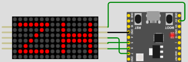

# max7219-driver

A platform agnostic driver to interface the MAX7219 (LED driver)

This project is quick generate with fork [write-driver-template](https://github.com/hello-embedded/write-driver-template)

## Examples

[examples](./examples/) is base on wokwi, you can run example see wokwi simulation.

```
make run mode=max7219
```



## reference

- [almindor/max7219](https://github.com/almindor/max7219)
- [apollolabsdev/max7219-driver](https://github.com/apollolabsdev/stm32-nucleo-f401re/tree/main/Drivers/max7219-driver)

## wokwi

- [project address](https://wokwi.com/projects/345754769993761364)
  - https://wokwi.com/projects/345754769993761364

## resources

- [datasheet](https://datasheets.maximintegrated.com/en/ds/MAX7219-MAX7221.pdf)
- [中文数据表](https://blog.csdn.net/qq_41650023/article/details/124705397)
- [25 SPI 控制器](https://www.espressif.com.cn/sites/default/files/documentation/esp32-c3_technical_reference_manual_cn.pdf)
- [SPI 通信讲解](https://blog.csdn.net/zhusongziye/article/details/121598552?ops_request_misc=%257B%2522request%255Fid%2522%253A%2522166597218516781432999991%2522%252C%2522scm%2522%253A%252220140713.130102334.pc%255Fblog.%2522%257D&request_id=166597218516781432999991&biz_id=0&utm_medium=distribute.pc_search_result.none-task-blog-2~blog~first_rank_ecpm_v1~rank_v31_ecpm-1-121598552-null-null.nonecase&utm_term=spi&spm=1018.2226.3001.4450)
- [SPI 通信视频讲解](https://mp.weixin.qq.com/s?__biz=MzI1MDg4OTMwMw==&mid=2247497099&idx=2&sn=cf271f04670f3cd24a97e650ed5fe598&chksm=e9f9e0b3de8e69a5cd377d796d8bc0307df1f90e47edd55151797789ad739a4aac457af54521&scene=21#wechat_redirect)
- [esp SPI 引脚介绍](https://www.espressif.com.cn/sites/default/files/documentation/esp32-c3_technical_reference_manual_cn.pdf)
  - 5.11 IO MUX 管脚功能列表
  - 25.5.2 FSPI 总线信号映射
  ```
  GPIO2 (FSPIQ: MISO/SIO1)、
  GPIO6 (FSPICLK)、GPIO7 (FSPID: MOSI/SIO0)、
  ```
